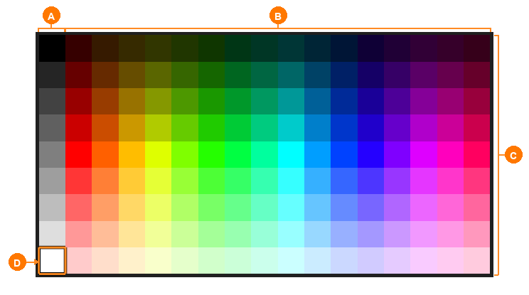
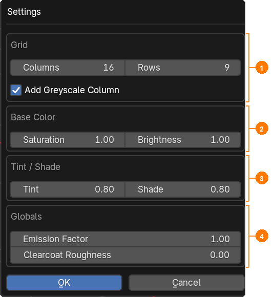

# Color Palette and PBR Presets

In Low Poly Colorizer, color values (albedo) and surface characteristics (PBR parameters) are managed independently and combined during rendering and shading.

---

## The Interactive Modal Palette Picker

Clicking the **Palette button** (color picker) in the N-Panel opens the color palette as a hardware-accelerated GPU overlay directly within the 3D Viewport.

| Area | Description |
|:---:|:---|
| **Ⓐ** | **Greyscale Column (Column 0)**: Neutral greys from pure black (top) to pure white (bottom) for monochrome surfaces or neutral shading. |
| **Ⓑ** | **Hue Spectrum (Columns 1–16)**: Full HSV color wheel from red through yellow, green, cyan, blue, to magenta laid out horizontally. |
| **Ⓒ** | **Brightness & Saturation Gradient (Rows 0–7)**: Vertical progression from deep shadow tones (top) through rich saturated colors to pale pastels (bottom). |
| **Ⓓ** | **Active Cell & Selection Frame**: Two-tone highlight frame indicating the currently selected cell $(X, Y)$ with instant assignment on click. |

### Navigation within the Picker Overlay

* **Select & Assign**: Click with the **left mouse button (LMB)** on any cell. The coordinates are stored, assigned to the current selection, and the overlay closes.
* **Zoom**: Scroll the **mouse wheel** to zoom continuously into or out of the palette grid (0.25× to 4.0×).
* **Pan**: Hold the **middle mouse button (MMB)** and drag to reposition the palette window anywhere in the viewport.
* **Cancel**: Press **Right-Click**, **Escape**, or click outside the palette to close the overlay without changing the current color selection.

---

## PBR Presets: Managing Material Looks

Each preset combines four standardized physical material parameters:

* **Roughness (0.0 – 1.0)**: Surface micro-roughness. Lower values yield sharp mirror reflections; higher values produce a soft, diffuse matte look.
* **Metallic (0.0 – 1.0)**: Metallic proportion. 0.0 corresponds to dielectrics (plastic, wood, stone); 1.0 corresponds to true conductive metals.
* **Emission (0.0 – 10.0)**: Surface self-illumination strength. The cell's albedo color serves as the emission tint.
* **Clearcoat (0.0 – 1.0)**: Secondary protective clear lacquer layer (e.g. automotive paints, varnished surfaces, or wet finishes).

> [!IMPORTANT]
> **Live Scatter Architecture:** Preset sliders do not modify individual mesh vertices or face loops; they update the central lookup table. Adjusting the *Roughness* of the *Solid* preset updates **every painted face in the entire project instantaneously**.

### Extended Preset Menu (`▾`)

* **Duplicate**: Creates a 1:1 duplicate of the active preset to quickly iterate on material variations.
* **Import / Export JSON**: Saves and loads preset definitions as portable JSON files—ideal for sharing material sets across projects.
* **Load Default Presets**: Restores the four bundled factory presets (*Solid*, *Metallic*, *Clearcoat*, *Emission*).

---

## Global Settings (*Settings…*)

Clicking **Settings…** in the N-Panel opens the configuration dialog for project-wide palette generation and shader parameters:

| Area | Description |
|:---:|:---|
| **①** | **Grid**: Column (*Columns*) and row (*Rows*) counts for the palette grid, plus a toggle for the monochrome greyscale column (*Add Greyscale Column*). |
| **②** | **Base Color**: Base saturation (*Saturation*) and base brightness (*Brightness*) for all hues in the color wheel. |
| **③** | **Tint / Shade**: Strength of the vertical gradation steps (highlighting via *Tint*, darkening via *Shade*). |
| **④** | **Globals**: Project-wide parameters including the global emission multiplier (*Emission Factor*) and base clearcoat roughness (*Clearcoat Roughness*). |
