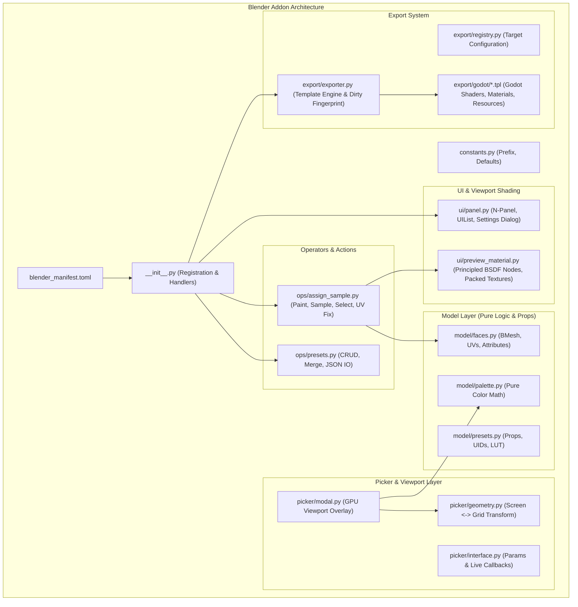

# Ausführliches Code-Review: Low Poly Colorizer (LPC)

**Projekt:** Low Poly Colorizer (LPC)  
**Version:** 0.1.0  
**Zielumgebung:** Blender 4.2+ (Extension System), Godot 4.x Engine  
**Datum:** 29. August 2026  
**Reviewer:** Leitender Software- & Blender-Pipeline-Architekt  

---

## 1. Executive Summary & Gesamteindruck

### 1.1 Zusammenfassung
Das Addon **Low Poly Colorizer (LPC)** ist ein Werkzeug für Low-Poly-Modeling-Workflows in Blender mit nahtloser Integration in Game-Engines (primär Godot 4). Anstatt für jede Farb- und Materialvariation eigene Materialien anzulegen, implementiert das Addon ein **Textur- und LUT-basiertes Indizierungssystem**:
- Pro Face werden lediglich zwei diskrete Referenzen gespeichert: ein **Paletten-Zellen-Index (x, y)** in `lpc_uv0` und ein **Preset-Listen-Index** in `lpc_uv1.x` sowie die Preset-UID im Face-Attribut `lpc_index`.
- Ein einziges Principled-BSDF-Material liest diese Werte über eine dynamisch generierte 2D-Farbpalette und eine 1D-PBR-Parameter-LUT aus.
- Beim Export nach Godot werden die passenden Shader, Materialien und Texturen über eine Template-Engine deterministisch generiert.

### 1.2 Qualitätsurteil
| Dimension | Bewertung | Kommentar |
|---|:---:|---|
| **Architektur & Design** | **A+ (Exzellent)** | Vorbildliche Schichtentrennung, strikte Wahrung von Invarianten, vollständige Entkopplung von Datenmodell und UI. |
| **Code-Qualität & Dokumentation** | **A (Sehr gut)** | Umfangreiche Modul- und Funktions-Docstrings mit detaillierter Erläuterung der Designentscheidungen. |
| **Blender API Konformität** | **A (Sehr gut)** | Volle Unterstützung des neuen Blender 4.2+ Extension-Manifests (`blender_manifest.toml`), saubere BMesh-/Mesh-Attribute-Nutzung, sauberes Handling von `undo_post`/`load_post`. |
| **Engine-Pipeline (Godot)** | **A+ (Exzellent)** | Hervorragende Lösung für das glTF-UV-V-Flip-Problem, robustes Handling von Lossless-/Alpha-Importfallen. |
| **Performance & Skalierbarkeit** | **B+ (Gut)** | Für Low-Poly-Meshes optimal; Optimierungspotenzial bei UI-Redraw-Refcount-Berechnungen in sehr dichten Szenen. |
| **Testabdeckung** | **C+ (Ausbaufähig)** | Code ist bereits für Headless-/No-Bpy-Tests vorbereitet (`try: import bpy`), aber es fehlt eine automatisierte Test-Suite. |

---

## 2. Detaillierte Architekturanalyse



### 2.1 Schichtentrennung & Single Source of Truth
Die Architektur folgt strengen, klar definierten Invarianten:
1. **Kein Derived State im `.blend`**: Faces speichern nur elementare Fakten (UID + Zell-Koordinaten). Bei Datei-Ladevorgängen muss kein komplexer Cache rekonstruiert werden.
2. **UID vs. Listenposition**:
   - Die `uid` (im Face-Attribut `lpc_index`) ist eine permanente, unveränderliche Identität.
   - Die Listenposition (in `lpc_uv1.x`) ist abgeleitet und indiziert die Shader-LUT. Änderungen von Preset-Werten erfordern **keinerlei Mesh-Traversierung**, sondern lediglich das Neuschreiben der 1D-LUT-Textur.
3. **Deterministische Farbpalette**:
   - `model.palette.color_at(x, y, params)` ist die einzige Berechnungsstelle für Farben. Weder Viewport-Picker noch Export-Templates berechnen abweichende Farbräume.
4. **Isolierte Geometrietransformation**:
   - `picker/geometry.py` kapselt die Koordinatentransformation (Screen-Pixel $\leftrightarrow$ Grid-Zelle) vollständig, inklusive `ui_scale`, Zoom und Pan.

---

## 3. Modul-für-Modul Code-Review

### 3.1 Extension-Root & Manifest (`addon/`)

#### [`blender_manifest.toml`](file:///e:/Projekte/low-poly-colorizer/addon/blender_manifest.toml)
- **Positiv**: Konform mit dem neuen Blender 4.2+ Extension-Standard (`schema_version = "1.0.0"`, `blender_version_min = "4.2.0"`, saubere SPDX-Lizenzangaben).
- **Hinweis**: Bei Veröffentlichung im offiziellen Blender Extensions Repository sollten optionale Felder wie `website`, `repository` und `permissions` ergänzt werden.

#### [`addon/__init__.py`](file:///e:/Projekte/low-poly-colorizer/addon/__init__.py)
- **Positiv**:
  - Vorbildliches Lebenszyklus-Management: `register()` registriert alle Klassen, Handler und Properties; `unregister()` räumt alle Timer, Handler und `bpy.types.Scene / WindowManager`-Properties in umgekehrter Reihenfolge vollständig auf.
  - Sicheres Seeding via `bpy.app.timers.register(_seed_on_enable, first_interval=0.0)` verhindert Mutationen während der Registrierungsphase.
  - `_redraw_on_undo_redo` fängt Undo/Redo ab, um den Live-Dirty-State des Export-Buttons im Viewport zuverlässig zu aktualisieren.
- **Verbesserungspotenzial**:
  - In `_redraw_on_undo_redo`: `bpy.context.window` und `bpy.context.window_manager` werden geprüft. In Multithread- oder Render-Phasen sollte zusätzlich `getattr(bpy.context, "window_manager", None)` abgesichert sein.

---

### 3.2 Model Layer (`addon/model/`)

#### [`addon/model/faces.py`](file:///e:/Projekte/low-poly-colorizer/addon/model/faces.py)
- **Positiv**:
  - **Dualer Mesh-Zugriff**: Strikte Einhaltung der Blender-Konvention: Im Edit-Mode wird über `bmesh.from_edit_mesh()` gearbeitet (da Datablock-Attribute dort ungültig sind), im Object-Mode über performantes `foreach_get` / `foreach_set`.
  - **glTF V-Flip Pre-Compensation**: `_encode_uv0` und `decode_palette_uv` handhaben die Invertierung der V-Achse ($1.0 - v$) konsistent und dokumentieren den mathematischen Hintergrund präzise.
  - `reorder_param_uvs_first`: Löst das Problem, dass Blenders glTF-Exporter `TEXCOORD_0` nicht nach Listenposition, sondern nach `active_render` zuweist. Der Neuaufbau der UV-Layer-Sammlung ist sauber implementiert.
- **Hinweis zu Skalierung/Performance**:
  - `scatter_list_position` iteriert über `bpy.data.meshes`. Bei Szenen mit hunderten von Meshes wird für jedes Mesh in Edit Mode `bmesh.from_edit_mesh(mesh)` aufgerufen. Dies geschieht jedoch nur bei Löschung/Reihenfolgeänderung von Presets, was im normalen Workflow selten vorkommt.

#### [`addon/model/palette.py`](file:///e:/Projekte/low-poly-colorizer/addon/model/palette.py)
- **Positiv**:
  - Vollkommen frei von `bpy`-Abhängigkeiten, deterministisch und exakt nachvollziehbar.
  - Mathematische Formel für Tint/Shade interpoliert stetig von Weiß ($t=0.0$) über Grundfarbe ($t=0.5$) nach Schwarz ($t=1.0$).
  - `build_pixels` liefert ein flaches RGBA-Float-Array, das direkt an `Image.pixels.foreach_set` übergeben werden kann.

#### [`addon/model/presets.py`](file:///e:/Projekte/low-poly-colorizer/addon/model/presets.py)
- **Positiv**:
  - Saubere Trennung zwischen reiner Python-Zähllogik (`reference_counts`) und der `bpy.types.PropertyGroup`-Ebene (`LPC_Preset`, `LPC_Globals`).
  - Lazy Refcounts verhindern Inkonsistenzen: Die Referenzanzahl wird dynamisch ermittelt, statt einen fehleranfälligen Zähler manuell mitzupflegen.
  - Property-Update-Callbacks (`_preset_values_changed`, `_globals_changed`) aktualisieren direkt die Shader-Nodes und die LUT-Textur, ohne Meshes zu verändern.

---

### 3.3 Picker Layer (`addon/picker/`)

#### [`addon/picker/geometry.py`](file:///e:/Projekte/low-poly-colorizer/addon/picker/geometry.py)
- **Positiv**:
  - Reine Dataclass `PickerGeometry`. Garantiert mathematisch, dass Hit-Testing und Rendering exakt dieselbe Transformationsmatrix verwenden ($\text{screen} = \text{origin} + \text{pan} + \text{cell} \cdot \text{size} \cdot \text{zoom} \cdot \text{ui\_scale}$).
  - Vollständige Unabhängigkeit von Blender-Modulen erlaubt isoliertes Unit-Testing.

#### [`addon/picker/interface.py`](file:///e:/Projekte/low-poly-colorizer/addon/picker/interface.py)
- **Positiv**:
  - Das `_suppress_live_apply`-Flag verhindert unerwünschte Nebeneffekte (wie automatisches Überschreiben von Face-Farben beim Sampling oder Ändern der Palette-Dimensionen).
  - Saubere Clamping-Logik für Zell-Koordinaten.
- **Kritischer Detailpunkt**:
  - In `_result_color_get(self)`:
    ```python
    scene = bpy.context.scene
    ```
    Bei Property-Gettern im UI-Thread kann `bpy.context` in seltenen Kontexten (z. B. Background-Execution, frühe Initialisierung) eingeschränkt sein. Ein `try/except (AttributeError, TypeError)` um den `context`-Zugriff erhöht die Ausfallsicherheit.

#### [`addon/picker/modal.py`](file:///e:/Projekte/low-poly-colorizer/addon/picker/modal.py)
- **Positiv**:
  - Nutzung der modernen Blender 4.x GPU-API (`gpu.shader.from_builtin("UNIFORM_COLOR")`, `gpu.shader.from_builtin("POLYLINE_UNIFORM_COLOR")`).
  - Saubere Koordinatenumrechnung relativ zur `WINDOW`-Region des 3D-Viewports (umgeht Versatz durch das N-Panel).
  - Intuitives Zoom-to-Cursor (`_zoom`) und Panning mit mittlerer Maustaste.
  - Vollständige Freigabe des Draw-Handlers in `_finish()`.

---

### 3.4 Operators Layer (`addon/ops/`)

#### [`addon/ops/assign_sample.py`](file:///e:/Projekte/low-poly-colorizer/addon/ops/assign_sample.py)
- **Positiv**:
  - `assign_current`: Unterstützt sowohl Teilflächen im Edit-Mode als auch ganze Objekte im Object-Mode.
  - `_paint_partial` reserviert gezielt Material-Slot 0 für unbemalte Flächen, sodass unbemalte Faces nicht fälschlicherweise das LPC-Material erben.
  - `LPC_OT_sample`: Ermittelt exakt die Zellkoordinaten und das Preset der aktiven Fläche, ohne ungenaue RGB-Näherungswerte.
  - `LPC_OT_fix_uv_maps`: Reparatur-Operator mit differenziertem Feedback an den Benutzer.

#### [`addon/ops/presets.py`](file:///e:/Projekte/low-poly-colorizer/addon/ops/presets.py)
- **Positiv**:
  - JSON-Import/Export mit Schemavalidierung (`version: 1`, Typprüfung, Clamping auf $[0.0, 1.0]$).
  - Intelligenter Namens-Merge (`merge_presets_by_name`): Existierende Presets werden aktualisiert, ohne ihre UID zu verändern (bestehende Mesh-Zuweisungen bleiben intakt).
  - Toleranz gegenüber Rundungsfehlern (`_VALUE_MATCH_EPS = 1e-6`) verhindert Scheinkonflikte beim Re-Import.
- **Befund (Dead Code)**:
  - In Zeile 231 von `addon/ops/presets.py` befindet sich nicht erreichbarer Code:
    ```python
    def _merge_report(added, updated, unchanged):
        parts = [ ... ]
        return ", ".join(parts) if parts else "nothing to import"
        return preset  # <-- DEAD CODE / Unreachable
    ```
    Das zweite `return preset` muss entfernt werden.

---

### 3.5 UI & Material Layer (`addon/ui/`)

#### [`addon/ui/panel.py`](file:///e:/Projekte/low-poly-colorizer/addon/ui/panel.py)
- **Positiv**:
  - Übersichtliches, ergonomisches N-Panel-Design.
  - Direkte Anzeige der Refcounts im `UIList`-Widget mit `FAKE_USER_ON`-Icon bei aktiver Nutzung.
  - Deletion-Guard: Löschen eines Presets ist nur möglich, wenn der Refcount 0 ist.
  - Modal-Dialog für globale Einstellungen (`LPC_OT_palette_settings`) mit vollem Undo/Cancel-Rollback (`_backup` & `cancel()`).
- **Performance-Analyse bei UI-Redraws**:
  - In `LPC_PT_palette_panel.draw()` werden `ops_assign_sample.selection_state(context)` und `model_presets.preset_refcounts(scene)` aufgerufen.
  - Bei jedem Maus-Hover oder Viewport-Render-Update wird `draw()` getriggert und traversiert alle Faces aller Meshes im Edit-Mode bzw. führt `foreach_get` auf allen Meshes im Object-Mode aus.
  - **Empfehlung**: Bei Standard-Low-Poly-Szenen (< 50.000 Faces) ist dies unspürbar. Für sehr große Szenen empfiehlt sich ein Caching der Refcounts mit Invalidierung über `depsgraph_update_post`.

#### [`addon/ui/preview_material.py`](file:///e:/Projekte/low-poly-colorizer/addon/ui/preview_material.py)
- **Positiv**:
  - Robuster Aufbau des Shader-Node-Trees mit automatischer Versionierung (`_NODES_VERSION = 7`). Bei Formatänderungen wird der Node-Tree automatisch migriert.
  - Texturen werden dynamisch erzeugt, mit `image.pack()` direkt in die `.blend`-Datei gepackt und mit `use_fake_user = True` vor Garbage Collection geschützt.
  - Saubere Identifizierung über Custom Properties (`_MANAGED_KEY`, `_PALETTE_MANAGED_KEY`), wodurch Namenskonflikte mit benutzerdefinierten Materialien ausgeschlossen werden.

---

### 3.6 Export & Templates Layer (`addon/export/`)

#### [`addon/export/exporter.py`](file:///e:/Projekte/low-poly-colorizer/addon/export/exporter.py) & [`addon/export/registry.py`](file:///e:/Projekte/low-poly-colorizer/addon/export/registry.py)
- **Positiv**:
  - **Engine-agnostische Architektur**: Der Exporter arbeitet generisch auf Verzeichnissen von `.tpl`-Dateien. Zusätzliche Engines (z. B. Unity, Unreal) können einfach durch neue Template-Ordner ergänzt werden.
  - **Deterministischer Dirty-Fingerprint**: `export_fingerprint(scene)` bildet einen Hash aus Palette, Presets und Globals. Der Export-Button leuchtet rot (`alert = True`), sobald ungespeicherte Änderungen vorliegen.
  - **GDScript-Identifier-Sanitization**: `_preset_identifiers` filtert Sonderzeichen via Unicode-NFKD, ersetzt "ß" durch "ss", erzwingt ASCII-Großbuchstaben und löst Namenskollisionen durch fortlaufende Nummern auf.

#### Godot 4 Templates (`addon/export/godot/`)
- **Positiv**:
  - `{{prefix}}common.gdshaderinc.tpl`: Zentrale Textur-Sampling-Funktionen (`lpc_sample_palette`, `lpc_sample_preset`) mit `textureLod(..., 0.0)` und `filter_nearest`.
  - `{{prefix}}singlecolor_resource.gd.tpl`: Exzellentes `@tool`-Resource-Script für Godot. Ermöglicht typsichere `Preset`-Enums im Godot-Inspector und autarke Farbberechnungen via `color_at()` ohne Textur-Lade-Overhead.
  - `README.md.tpl`: Detaillierte Anleitung für Godot-Nutzer bezüglich der kritischen Importeinstellungen (**Detect 3D = Disabled**, **Compress = Lossless**, **Fix Alpha Border = Off**).

---

### 3.7 Build Script (`build_addon.py`)

#### [`build_addon.py`](file:///e:/Projekte/low-poly-colorizer/build_addon.py)
- **Positiv**: Erstellt saubere ZIP-Pakete unter Ausschluss von `__pycache__` und temporären Dateien. Liest Version und ID direkt aus `blender_manifest.toml`.
- **Befund**:
  - In `read_branch()` wird `git rev-parse --abbrev-ref HEAD` via `subprocess.run(..., check=True)` ausgeführt.
  - Wenn das Repository ohne `.git`-Verzeichnis (z. B. als Quellcode-ZIP von GitHub) heruntergeladen und gebaut wird, schlägt der Aufruf mit `CalledProcessError` fehl.
  - **Empfehlung**: `try/except`-Block um den Git-Aufruf mit Fallback auf `"main"` oder `"release"`.

---

## 4. Befunde & Optimierungspotenziale

Die Analyse ergab keine kritischen Sicherheitslücken oder Datenverlust-Risiken. Nachfolgend sind alle identifizierten Befunde nach Dringlichkeit aufgeführt:

### Übersicht der Befunde

| ID | Datei | Zeile | Typ | Schweregrad | Beschreibung |
|---|---|:---:|:---:|:---:|---|
| **BUG-01** | `addon/ops/presets.py` | 231 | Code Quality | **Niedrig** | Toter / unerreichbarer Code (`return preset` nach `return`) in `_merge_report`. |
| **BUG-02** | `build_addon.py` | 35-40 | Robustheit | **Mittel** | `read_branch()` stürzt ab, wenn kein Git-Repository vorhanden ist (`check=True`). |
| **PERF-01** | `addon/ui/panel.py` | 183, 193 | Performance | **Mittel** | Volle Mesh-Traversierung (`selection_state` & `preset_refcounts`) bei jedem UI-Panel-Redraw. |
| **QUAL-01** | Repository Root | - | Testing | **Mittel** | Keine automatisierte Unit-Test-Suite vorhanden, obwohl der Code bereits für Standalone-Python vorbereitet ist. |
| **SAFE-01** | `addon/picker/interface.py` | 171-179 | Robustheit | **Niedrig** | Direkter `bpy.context.scene`-Zugriff im Property-Getter ohne `try/except`. |

---

### Detaillierte Lösungsvorschläge

#### 1. Behebung BUG-01 (Dead Code in `addon/ops/presets.py`)
```python
# Vorher:
def _merge_report(added, updated, unchanged):
    parts = [
        f"{n} {label}"
        for n, label in (
            (added, "added"), (updated, "updated"), (unchanged, "unchanged")
        )
        if n
    ]
    return ", ".join(parts) if parts else "nothing to import"
    return preset  # <-- Entfernen

# Nachher:
def _merge_report(added, updated, unchanged):
    parts = [
        f"{n} {label}"
        for n, label in (
            (added, "added"), (updated, "updated"), (unchanged, "unchanged")
        )
        if n
    ]
    return ", ".join(parts) if parts else "nothing to import"
```

#### 2. Behebung BUG-02 (Robuster Git-Branch-Lookup in `build_addon.py`)
```python
# Robuste Variante mit Fallback:
def read_branch():
    try:
        result = subprocess.run(
            ["git", "rev-parse", "--abbrev-ref", "HEAD"],
            cwd=ROOT, capture_output=True, text=True, check=False,
        )
        if result.returncode == 0 and result.stdout.strip():
            branch = result.stdout.strip()
            return re.sub(r"[^A-Za-z0-9._-]+", "-", branch)
    except Exception:
        pass
    return "main"
```

#### 3. Optimierung PERF-01 (Caching für Refcounts)
Für sehr komplexe Szenen kann die Berechnung der Refcounts an den Blender-Depsgraph gekoppelt werden (`bpy.app.handlers.depsgraph_update_post`), sodass bei reinen Mausbewegungen über das Panel nur der gecachte Wert gelesen wird.

---

## 5. Bewertung der Engine-Pipeline (Godot 4)

Die Export-Pipeline nach Godot 4 ist ein besonderes Highlight dieses Projekts:
1. **Material Override & Draw Calls**: Alle Faces einer Spielfigur oder eines Low-Poly-Assets teilen sich genau ein ShaderMaterial (`lpc_multicolor.tres`). Dies minimiert Draw-Calls in Godot drastisch.
2. **Singlecolor-Workflow**: Durch `{{prefix}}singlecolor_resource.gd` und Instance-Uniforms können generische Meshes (z. B. Environment-Props) ohne zusätzliche Materialien dynamisch eingefärbt werden.
3. **Dokumentation**: Die exportierte `README.md` schützt Entwickler zuverlässig vor den bekannten Fallstricken des Godot-Texture-Importers (VRAM-Kompression und Alpha-Border-Fix).

---

## 6. Fazit & Empfohlene Roadmap

Das Addon befindet sich in einem **hervorragenden, produktionsreifen Zustand** für Version 0.1.0. Das Design ist durchdacht, elegant und folgt modernen Blender-Best-Practices.

### Empfohlene nächste Schritte:
1. **Patch 0.1.1**:
   - Entfernen des Dead-Code-Statements in `addon/ops/presets.py`.
   - Absicherung des Build-Skripts `build_addon.py` gegen fehlendes Git.
2. **Testing-Infrastruktur**:
   - Einrichtung eines `tests/`-Verzeichnisses mit `pytest`.
   - Automatisierte Tests für `palette.py` (Farbwerte & Clamping), `presets.py` (JSON-Validierung), `geometry.py` (Hit-Testing) und `exporter.py` (Identifier-Sanitization).
3. **Erweiterungen (Optional)**:
   - Zusätzliche Export-Templates (z. B. für Unity Shader Graph oder Unreal Engine).
   - Farbharmonien / Paletten-Presets (z. B. Triadisch, Komplementär).

---
*Review abgeschlossen am 29.08.2026.*

